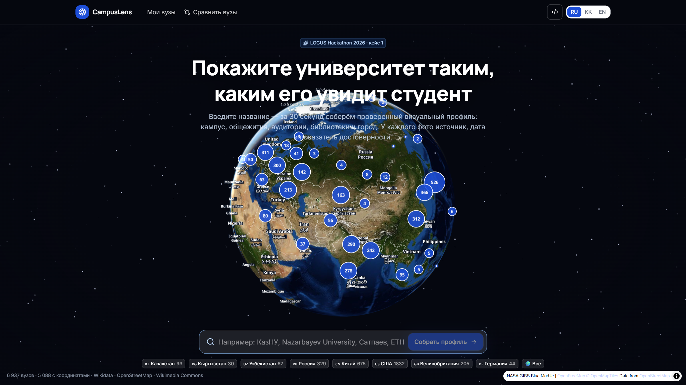
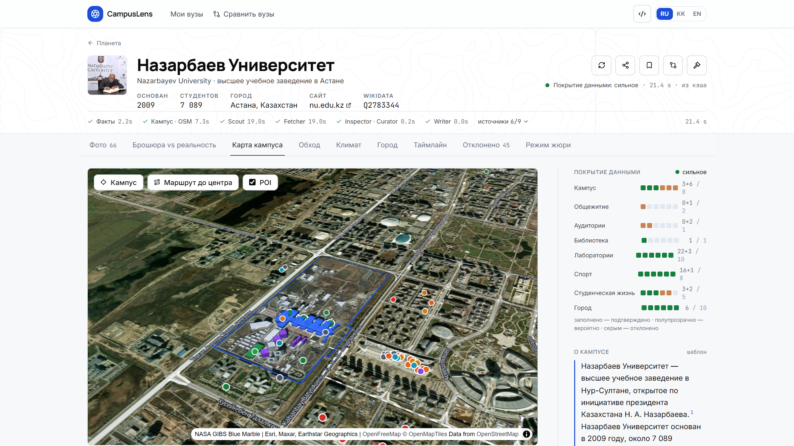
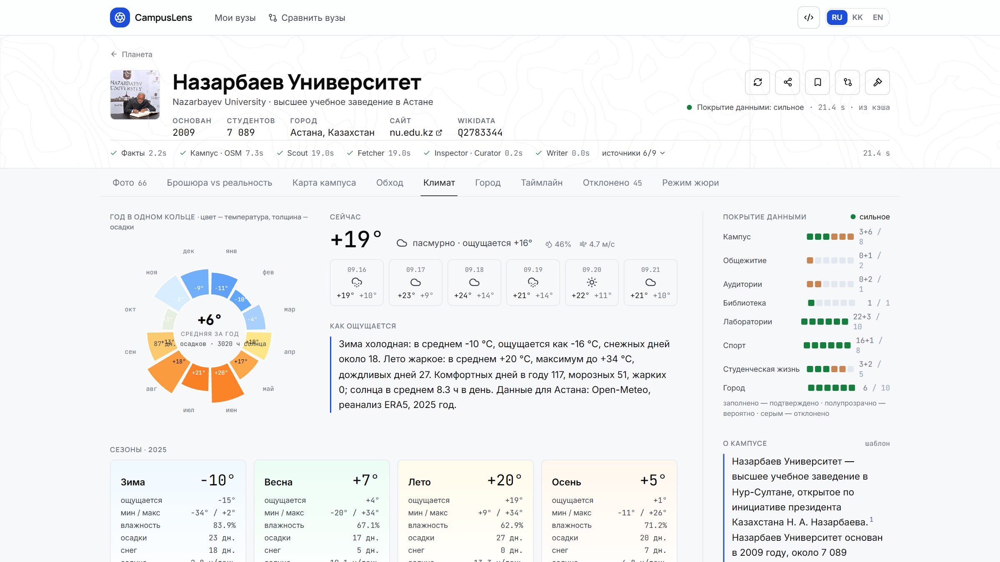
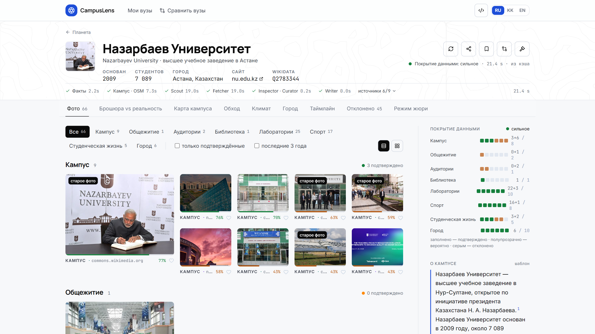
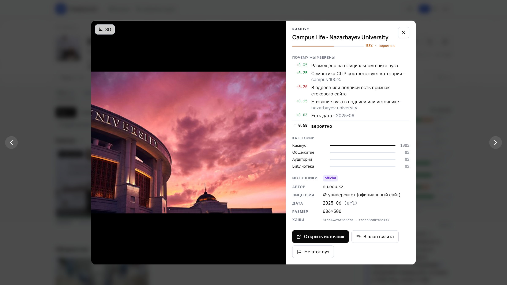
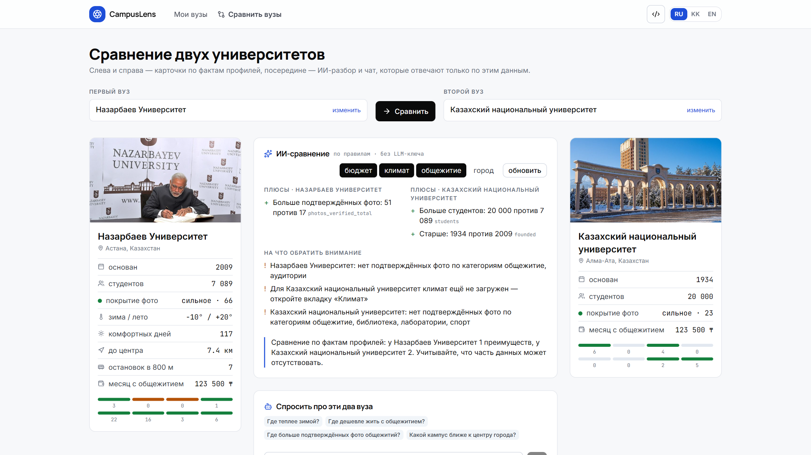
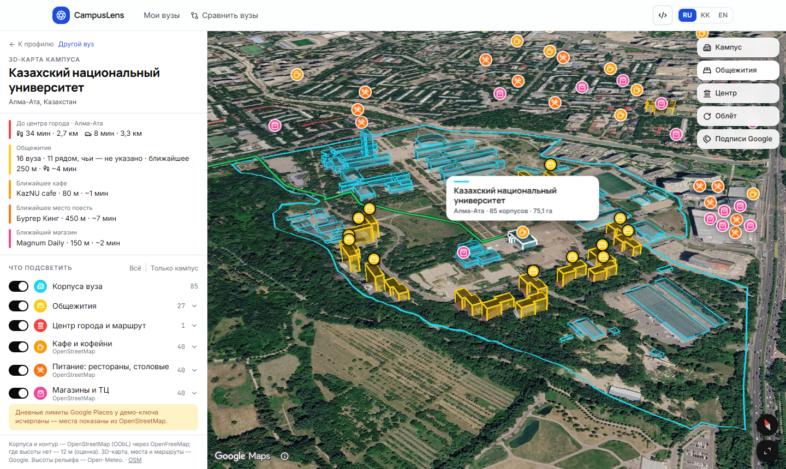
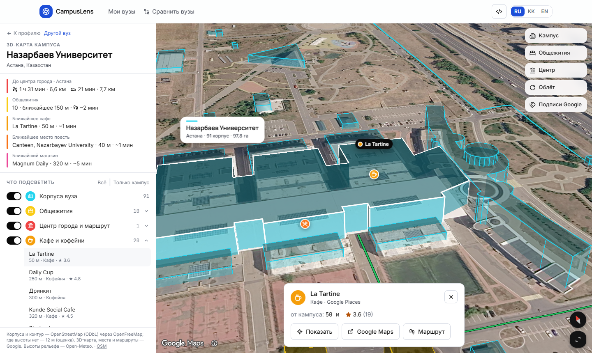
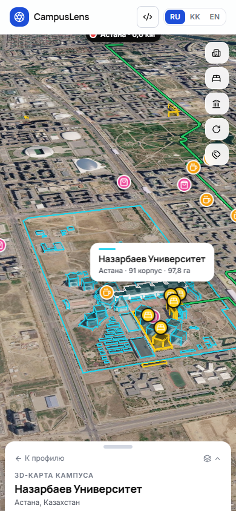

# CampusLens — проверенный визуальный профиль университета

LOCUS Startup Hackathon 2026 · кейс 1 · код сабмита `LOCUSCASE1`

Введите название вуза — планета поворачивается, камера ныряет сквозь облака к кампусу, здания поднимаются из
спутникового снимка, а под ними за ≤ 25 секунд собирается профиль: фото кампуса, общежитий, аудиторий,
библиотек, лабораторий, спорта, студенческой жизни и города. У каждого фото — кликабельный источник, дата,
лицензия и объяснимый показатель достоверности. Ничего не подделываем: отклонённые кандидаты видны с причинами,
пустые категории честно пустые.

## Как это работает

| Агент | Что делает |
|---|---|
| **Scout** | ищет кандидатов параллельно: официальный сайт вуза и его соцсети (Instagram и TikTok через ScrapeCreators, Telegram, YouTube-канал — кадры из середины роликов, VK по ключу; аккаунты берутся с сайта, а если их там нет — из Wikidata), **посты других людей, где отмечен аккаунт вуза** (студклубы, команды, выпускники), Wikimedia Commons (категория, «depicts», геопоиск, поиск по названию), статьи Википедии, Google Картинки по категориям через Serper («<вуз> общежитие», «… библиотека»…), ролики о вузе с любых каналов (YouTube Data API), поиск TikTok, Openverse, геофото Mapillary у кампуса, **фото из отзывов на Google Картах** (привязаны к объекту вуза, а не к тексту запроса) и **фото с геометкой у кампуса во ВКонтакте** (снято прохожими и студентами) |
| **Fetcher** | скачивает, отбрасывает мелкое и битое, считает SHA-1, pHash, dHash, читает EXIF |
| **ИИ-инспектор** | vision-модель (`gemini-3.5-flash-lite`, низкое разрешение — 280 токенов на фото) смотрит **каждое** фото рядом с эталонным снимком вуза (Wikidata P18) и отвечает: это этот вуз / город / другое место / не фото, уверенность 0–3, категория, наглядность 0–3, флаги (сток, баннер, фрагмент, рисунок, официальная встреча…), примерное десятилетие. Пачки по 12 фото уходят, пока источники ещё собираются; ответы кэшируются по (вуз, SHA-1) |
| **Inspector** | независимые сигналы → уверенность 0–1: вердикт ИИ, тип источника, геометка внутри полигона OSM, сходство с эталоном (CLIP), название вуза в подписи, повтор в источниках, дата, флаги пользователей. Источник сам по себе не доказательство: фото из статьи о городе — это фото города |
| **Curator** | копии (SHA-1 / pHash), визуально похожие (косинус CLIP), мусор; компактная подборка — до 6–8 лучших и непохожих кадров на категорию, остальное за кнопкой «Показать все» |
| **Writer** | описание кампуса с цитатами из Википедии, Wikidata, OSM, климата и подтверждённых фото; шаблон без ключа |

Пороги: подтверждено ≥ 0.65 · вероятно ≥ 0.40 · ниже — отклонено (видно во вкладке «Отклонено» с причиной). Узкие полосы
(шире 2.4:1) с сайтов и соцсетей отбрасываются ещё до проверки.

**Измеренная точность** (`scripts/eval.py`, ручная разметка `data/labels.json`: 7 вузов — НУ, КБТУ, КазНУ, Satbayev,
Кокшетау, ABU, Мирас; ~200 фото, 17.09.2026; «принадлежит» = фото этого вуза или его города, баннеры, сток, портреты и
официальные встречи — нет):

| | без ИИ-инспектора | с ИИ-инспектором и новыми источниками |
|---|---|---|
| precision / recall / F1 | 0.86 / 0.89 / 0.88 | **0.94 / 0.94 / 0.94** |
| категория верна | 0.75 | **0.96** |
| строгая точность (фото и категория) | 0.67 | **0.91** |
| точность подборки куратора | — | **0.93** |

Что дали новые источники: у региональных вузов вместо 6 городских снимков — 30–40 фото корпусов, общежитий и
библиотек (Кокшетау: 6 → 30, ABU: 11 → 40); у Satbayev подборка закрывает все 8 категорий.
Правила для поисковой выдачи строже, чем для каналов вуза: фото из поиска без проверки ИИ не показывается, а если на
странице нет названия вуза, нужна полная уверенность ИИ (аббревиатуры совпадают: КГУ — и Кокшетау, и Курган).

Время сборки нового вуза — 15–26 с (жёсткий потолок 29 с), первые фото — через ~5 с. Стоимость нового вуза ≈ 2–4 цента:
Gemini ≈ 1,5 ¢, Serper 8 запросов ≈ 0,8 ¢, ScrapeCreators 3 запроса ≈ 0,6 ¢; повторная сборка — из кэша.

## Функции

- **Любой вуз по запросу**: офлайн-индекс 14 467 вузов → живой поиск Wikidata → OpenStreetMap (Nominatim) для вузов, которых нет в Wikidata: название, координаты, город, сайт; профиль собирается так же (кандидат помечен «веб»).
- **Соцсети как источник фото**: аккаунты вуза находятся по ссылкам на сайте, а если сайт их не публикует — по Wikidata (P2003/P7085/P3789/P3185). Telegram (посты с фото и подписями), YouTube (кадры видео), VK (по бесплатному сервисному токену `VK_SERVICE_TOKEN`), Instagram и TikTok. Лента вуза — это пресс-служба: грамоты, афиши, президиумы; поэтому берутся ещё и посты, в которых вуз **отметили** другие аккаунты. У каждого фото ссылка на пост.
- **Фото не от вуза, а от людей**: два источника, где якорь не текст запроса, а место. Отзывы на Google Картах привязаны к объекту вуза (place id), а `photos.search` во ВКонтакте отдаёт публичные фото, которым автор сам поставил геометку в 800 м от кампуса. Стоковую картинку никто не геотегирует — зато в кадр попадают коридор перед экзаменом, очередь в столовой и первый снег на площади. Геометка — это заявление, а не доказательство: фото всё равно проходит ИИ-инспектора, расстояние считается от полигона кампуса, а крупные планы людей отклоняются (чужое личное фото рядом с кампусом — не кампус). Без вердикта ИИ такое фото не показывается вовсе.
- **Планета → перелёт → 3D-кампус** (MapLibre GL, NASA Blue Marble, спутник Esri, здания OpenStreetMap, без ключей).
- **Профиль**: альбомы по категориям, фильтры кейса, паспорт фото с сигналами, «брошюра vs реальность», таймлайн, отклонённые, режим жюри.
- **3D-карта кампуса**: полигон, здания по типу (общежитие / библиотека / спорт / корпус), маршрут до центра (OSRM), POI в радиусе 1 км.
- **3D-карта кампуса на Google (`/map3d/{qid}`, кнопка «3D-карта Google» в профиле и в сцене прилёта)**: фотореалистичная 3D-карта
  Google Maps JavaScript API (`maps3d`), поверх неё подсветка, которую пользователь включает сам: корпуса вуза (бирюзовые объёмы
  из OpenStreetMap), общежития (жёлтые; «вуза» — внутри контура или по названию, остальные — «рядом, чьи — не указано»),
  центр города с маршрутом пешком и на машине (Google Routes), кафе, питание, магазины, развлечения, культура, парки, спорт,
  транспорт, аптеки (Google Places API New, при исчерпании лимита — текстовый поиск Google, затем OpenStreetMap) и проверенные
  фото с геометкой. У каждого места — расстояние от кампуса, маршрут пешком, рейтинг и ссылка на Google Maps. Камера: кампус,
  общежития, центр, облёт; подписи Google включаются отдельно. Контуры зданий и места OSM читаются из векторных тайлов
  OpenFreeMap (`backend/app/pipeline/map3d.py`, `GET /api/map3d/{qid}`, `POST /api/map3d/footprints`), высота рельефа — Open-Meteo.
- **Климат** (Open-Meteo, ERA5): кольцо года, четыре сезона, индекс комфорта студента, роза ветров, живой слой ветра/облаков Windy, «как ощущается».
- **Город**: расстояние и время до центра, остановки, ближайшая станция, аэропорт, население, бюджет студента с источниками.
- **Мои вузы**: сохранённые профили, избранные фото, план визита (localStorage, экспорт/импорт).
- **Сравнение**: две карточки + ИИ-плюсы/минусы + чат, отвечающий только по фактам профилей (без ключа — сравнение по правилам).
- **Шаринг**: ссылка `/s/{qid}` отдаёт Open Graph теги и карточку-превью 1200×630 (`/api/og/{qid}.png`) с фото, городом и числом подтверждённых снимков; люди перенаправляются в профиль.
- **Катсцены (ветка Higgsfield)**: файл `frontend/public/cutscenes/{qid}.mp4` проигрывается между перелётом и профилем, без файла ничего не меняется.
- **Интеграция**: `GET /api/schema`, `POST /api/ingest` для внешних коллекторов, общие хэши — см. `docs/INTEGRATION.md`.

## Запуск

```bash
# backend (Python 3.12)
cd backend
pip install -r requirements.txt
cp .env.example .env                        # ключи опциональны (Gemini бесплатно: aistudio.google.com)
python scripts/build_university_index.py    # один раз, ~15 мин: офлайн-индекс 14 467 вузов из Wikidata (44 страны)
python scripts/export_geojson.py            # точки для глобуса → frontend/public
python scripts/prewarm.py                   # опционально: прогрев 33 вузов из data/prewarm_list.json
python scripts/refresh_campus.py            # если Overpass был недоступен при прогреве: дотянуть корпуса OSM и городские пакеты
python -m uvicorn app.main:app --port 8000

# frontend (Node 20+)
cd ../frontend
npm install
npm run dev                                 # http://localhost:5173 (прокси /api → 8000); вторая пара: npm run dev -- --mode alt (5180 → 8010)
```

Тесты без браузера: `python scripts/smoke.py Q427677` (КазНУ), `python scripts/smoke.py --search "Univer Almatyy"`.

## Тестовый сценарий для жюри

1. Откройте сайт, введите вуз, которого нет в демо (например «ETH Zürich» или «Университет Мальты»), выберите кандидата.
2. Дождитесь прилёта (3,4 с) — здания поднимутся; нажмите «Открыть профиль». Первые фото ≤ 4 с, полный профиль ≤ 25 с; время видно в полосе агентов.
3. Откройте 5 фото: источник открывается и содержит это фото; панель «почему мы уверены» объясняет балл.
4. Вкладки «Отклонено», «Брошюра vs реальность», «Карта кампуса», «Климат», «Город», «Режим жюри».
5. Введите «Univer Almatyy» и «qwerty» — опечатки находятся, мусор даёт честное «не нашли».
6. Сохраните два вуза → «Сравнить».

## Стек

Python 3.12 · FastAPI · httpx · SSE · open_clip (CLIP ViT-B/32, CPU) · imagehash · shapely · rapidfuzz · SQLite ·
React 19 · TypeScript · Vite · Tailwind v4 · MapLibre GL JS 6 · OpenFreeMap · NASA GIBS · Esri World Imagery · Open-Meteo · OSRM ·
Gemini / Claude (опционально).

## Источники данных и лицензии

Wikidata (CC0), Wikipedia и Wikimedia Commons (лицензии указаны у каждого файла), Openverse (открытые лицензии), OpenStreetMap (ODbL), OpenFreeMap,
NASA GIBS Blue Marble (public domain), Esri World Imagery (атрибуция на карте), Open-Meteo (CC BY 4.0), OSRM demo,
Windy (embed), официальные сайты вузов, Google Картинки и отзывы на Google Картах через Serper, ВКонтакте (официальный API, сервисный токен), Instagram и TikTok через ScrapeCreators, YouTube Data API
(везде — превью со ссылкой на страницу, пост или видео). Фото принадлежат их авторам; мы храним
ссылки, метаданные и превью-кэш.

## Известные ограничения

- Покрытие Commons и OSM для небольших региональных вузов бывает слабым — тогда профиль честно показывает пустые категории.
- Часть сайтов вузов отдаёт неполную цепочку SSL; для чтения публичных страниц используется повтор без проверки сертификата.
- Публичный OSRM отдаёт только автомобильный профиль; время пешком считается по расстоянию.
- Overpass (overpass-api.de) периодически перегружен: тогда корпуса OSM и POI в профиле пустые, пакет не кэшируется и дотягивается при следующем открытии или `scripts/refresh_campus.py`.
- Без ключей Gemini/Claude ИИ-инспектор отключён (остаются CLIP и сигналы источников), описание и чат работают в режиме шаблонов и правил. С ключом Gemini используется
  `gemini-3.5-flash-lite` (ответ за 1–2 с); модели `gemini-3.x-flash` «думают» 20–60 с и не укладываются в бюджет, `gemini-2.5-flash` закрыт для новых ключей.
- Бюджет студента — курируемый датасет для 6 городов с источниками; для остальных «нет данных».
- Instagram и TikTok читаются через сторонний сервис ScrapeCreators (официальный доступ Meta настраивается): храним только
  превью 640 px, дату и ссылку на пост; ссылки CDN этих платформ истекают, поэтому источник — всегда сам пост.
- Бесплатный тариф Gemini ограничивает частоту запросов: при нагрузке часть фото может не успеть пройти проверку —
  такие фото из поиска не показываются, а у каналов вуза помечаются «ИИ не успел проверить».

- 3D-карта Google работает по ключу `VITE_GOOGLE_MAPS_3D_KEY` (`frontend/.env`). Сейчас это демо-ключ Google: он для разработки,
  у Places (Nearby Search и Text Search) маленький дневной лимит (сбрасывается в полночь по Тихоокеанскому времени = 12:00 по Астане).
  Когда лимит исчерпан, страница сама переключается на текстовый поиск Google, затем на места из OpenStreetMap и пишет об этом.
  Для публичного сайта нужен обычный ключ с ограничением по адресу сайта (бесплатно 5 000 загрузок 3D-карты в месяц).

## Скриншоты

| Планета | 3D-кампус | Климат |
|---|---|---|
|  |  |  |

| Профиль | Паспорт фото | Сравнение |
|---|---|---|
|  |  |  |

| 3D-карта Google: КазНУ | Выбранное место и маршрут | Телефон |
|---|---|---|
|  |  |  |

Снимаются автоматически: `python scripts/screenshots.py` · 3D-карта: `python scripts/check_map3d.py --random 5` (любые вузы, скриншоты и проверка слоёв) (Playwright, headless Chromium).

## Материалы сабмита

- Презентация (8 слайдов): `docs/pitch/CampusLens.pdf` (генератор `docs/pitch/build_deck.mjs`, слайд «Команда» — заполнить).
- Демо-ролик без звука с титрами: `docs/video/demo.mp4` (записывается автоматически: `python scripts/demo_video.py` при запущенных серверах; озвучку добавить поверх).
- Техническая справка: `docs/TECH_NOTE.md`. Сценарий демо-видео и защиты: `docs/DEMO_SCRIPT.md`.
- Деплой: `docs/DEPLOY.md` (Hugging Face Spaces + Vercel, Dockerfile и vercel.json готовы).

## Документы

`docs/SPEC.md` — полная спецификация · `docs/VISION.md` — идеи и исследование · `docs/ARCHITECTURE.md` — пайплайн и формула уверенности ·
`docs/RESEARCH.md` — замеры источников · `docs/INTEGRATION.md` — контракт для Next.js/Node части · `docs/PLAN.md` — график ·
`docs/PITCH_OUTLINE.md` — структура слайдов.

## Команда

Роли и вклад — заполнить перед сабмитом (капитан, backend, frontend, данные/материалы).
