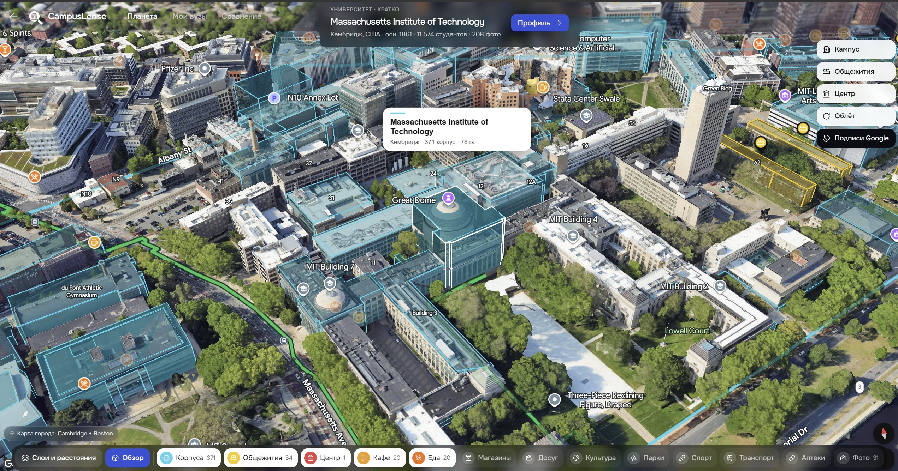

# CampusLense

Visual university exploration with 3D campus maps, verified photographs and traceable sources.

**QwertyS · LOCUS Startup Hackathon · September 2026 · First place**

[Live demo](https://nnurkhan91--campuslense-web.modal.run) · [Demo video](docs/video/demo.mp4) · [Technical notes](docs/TECH_NOTE.md) · [Pitch deck](docs/pitch/CampusLens.pdf)



## What it does

A university search moves from a globe into a campus view while the backend assembles a profile from university websites, maps and media sources. Images pass relevance checks and retain their source, date and verification context. Profiles cover buildings, accommodation, facilities, campus life and the surrounding city.

- Search an offline index of **14,467 universities**, supplemented by live discovery.
- Explore campus locations through MapLibre and Google Maps 3D.
- Inspect accepted and rejected photographs with reasons and source links.
- Receive incremental results through server-sent events.

## Engineering

**Backend:** Python 3.12, FastAPI, SQLite, httpx, CLIP, image hashing and image processing. **Frontend:** React 19, TypeScript, Vite, Tailwind CSS, MapLibre GL JS and Google Maps APIs.

The pipeline discovers sources in parallel, downloads candidate media, removes duplicates, checks relevance and streams results to the interface. Source availability depends on the configured API keys; unavailable integrations are surfaced in the verification view.

## Evaluation

The repository reports **0.94 precision and 0.94 recall** for photograph relevance on **223 manually labelled images**, with 0.95 category accuracy. These are internal evaluation results. They describe that labelled sample, rather than a guarantee for every university or source. The documented benchmark reaches a complete profile in approximately 23 seconds.

## Run locally

Use Python 3.12, Node.js 20+ and ffmpeg. Run the API and frontend in separate terminals:

```bash
cd backend
pip install -r requirements.txt
cp .env.example .env
python -m uvicorn app.main:app --port 8000
```

```bash
cd frontend
npm install
cp .env.example .env
npm run dev
```

Configure the keys listed in the environment templates. The frontend runs at http://localhost:5173 and proxies API requests to port 8000. See [technical notes](docs/TECH_NOTE.md) for integrations, data provenance and evaluation details.

## Team and development

Co-developed by **[Shakhnazar Akhmer](https://github.com/Eye172)** and **[Nurkhan Aimukatov](https://github.com/pip00sya)** as **QwertyS** for LOCUS Startup Hackathon 2026. Both worked on the software and product implementation. This repository contains the hackathon submission; the team mirror is [pip00sya/locus](https://github.com/pip00sya/locus).

[Original detailed documentation in Russian](README.original.md) preserves the full submission notes, screenshots and implementation reference.
